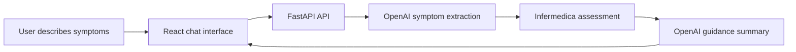

# HealthTalk

HealthTalk is a full-stack virtual health-assistant prototype designed to make early symptom guidance more approachable. Users share their age, sex, and symptoms in everyday language; the app standardizes symptoms with an LLM, requests a clinically grounded assessment from Infermedica, and presents the result in a clear, empathetic conversational format.

> **Medical disclaimer:** HealthTalk provides general educational information only. It is not a substitute for professional medical advice, diagnosis, or treatment. For a medical emergency, call 911 or your local emergency number immediately.

## Why HealthTalk?

People can delay seeking care because of cost, limited access, uncertainty, or difficulty interpreting health information online. HealthTalk explores how conversational AI and a symptom-checking API can work together to provide a more understandable starting point for people seeking early health guidance.

## How it works



1. The assistant gathers the user’s age, sex, and free-text symptom description.
2. OpenAI maps the description to approved Infermedica symptom terms.
3. Infermedica returns an initial condition assessment from the supplied evidence.
4. OpenAI formats a cautious, easy-to-read response with general guidance and follow-up conversation.

## Features

- Conversational intake for age, sex, and symptoms
- Free-text symptom extraction and normalization
- Infermedica-powered initial condition assessment
- Empathetic, plain-language AI responses
- Session-based chat state for multi-turn conversations
- Responsive React chat interface
- Clear reminder that professional care is essential for emergencies and personal medical decisions

## Tech stack

| Layer | Technologies |
| --- | --- |
| Frontend | React, Vite, Lucide React |
| Backend | Python, FastAPI, Uvicorn, Pydantic |
| AI | OpenAI API (`gpt-4o-mini`) |
| Clinical symptom data | Infermedica API |

## Project structure

```text
HealthTalk/
├── frontend/                 # React + Vite chat experience
│   └── src/
│       ├── components/       # Chat, input, message, header, and sidebar UI
│       └── App.jsx
└── backend/                  # FastAPI service
    ├── api/                  # Request models and chat endpoints
    ├── config/               # Environment-based application settings
    ├── core/logic.py         # Conversation, LLM, and Infermedica workflow
    ├── main.py               # FastAPI application entry point
    └── requirements.txt
```

## Getting started

### Prerequisites

- Node.js 18+
- Python 3.10+
- An [OpenAI API key](https://platform.openai.com/api-keys)
- Infermedica application credentials

### 1. Start the backend

```bash
cd backend
python -m venv .venv
source .venv/bin/activate
pip install -r requirements.txt
```

Create `backend/.env` with your credentials:

```env
OPENAI_API_KEY=your_openai_api_key
INFERMEDICA_APP_ID=your_infermedica_app_id
INFERMEDICA_APP_KEY=your_infermedica_app_key
```

Then run the API:

```bash
uvicorn main:app --reload --port 8001
```

The API will be available at `http://localhost:8001`, with interactive documentation at `http://localhost:8001/docs`.

### 2. Start the frontend

Open a second terminal:

```bash
cd frontend
npm install
npm run dev
```

Open the local URL printed by Vite (normally `http://localhost:5173`). The frontend is configured to communicate with the backend at `http://localhost:8001`.

## API endpoints

| Method | Endpoint | Description |
| --- | --- | --- |
| `POST` | `/api/chat/init_session` | Creates a chat session and returns the opening message. |
| `POST` | `/api/chat` | Sends a user message and returns the assistant response. |

Example request:

```json
{
  "session_id": "a-unique-session-id",
  "message": "I'm 20, female, and I've had a fever and sore throat."
}
```

## Current limitations and future work

HealthTalk is a learning and research prototype, not a deployed clinical product. It currently keeps conversation state in memory, depends on third-party APIs, and should not be used to make medical decisions.

The original project roadmap included:

- Retrieval-augmented responses from trusted medical sources with citations
- A symptom timeline and tracker
- User feedback to improve clarity and prompts
- Stronger red-flag detection and escalation workflows

## Contributors

Created by **Hannah Sanders** and **Fatima Boukari** at Delaware State University.

## Acknowledgment

This project was presented as part of a Delaware State University summer research program. The project poster acknowledges support from NSF awards #2219731 and #2123004, NIH/NIBIB award #1UG3EB036465, and NIH/NIGMS award #P20GM103446.
